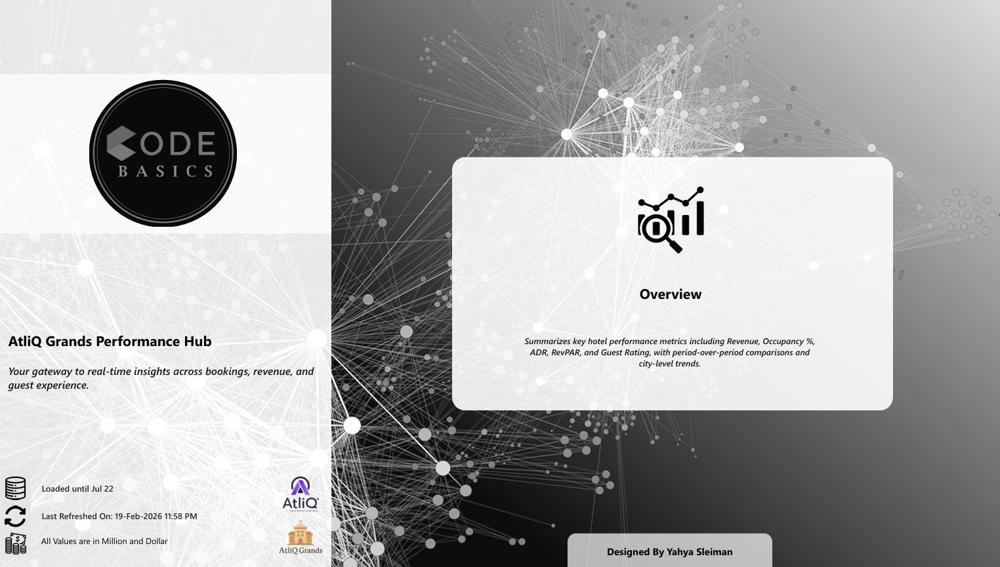
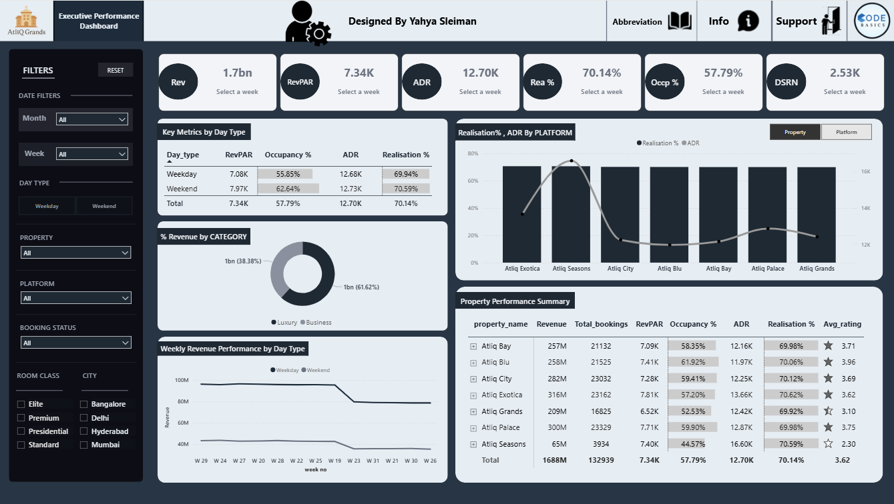
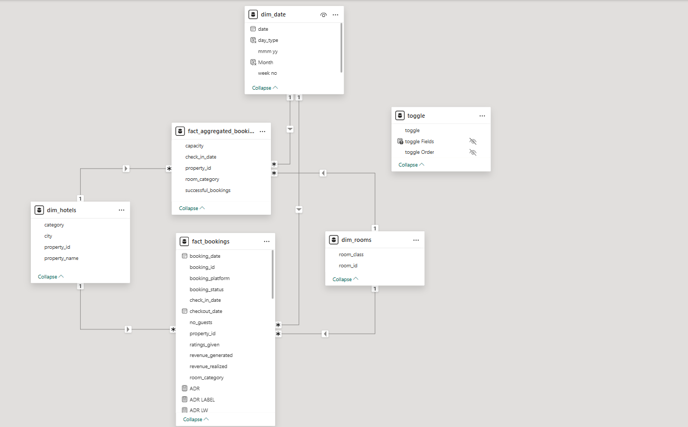

# 🏨 AtliQ Grands Hospitality Analytics Dashboard

An end-to-end Power BI analytics project focused on hotel booking performance, revenue optimization, occupancy analysis, and guest experience insights for the hospitality industry.

---

# 🔗 Live Dashboard

[Click Here to View Dashboard](https://app.powerbi.com/view?r=eyJrIjoiOTRkYmI0ZjUtMzZmNy00ZGU2LWI5NzgtODEzMmMxNmI4NjYzIiwidCI6ImM2ZTU0OWIzLTVmNDUtNDAzMi1hYWU5LWQ0MjQ0ZGM1YjJjNCJ9&pageName=c65bd517f429678dc156)

---

# 📌 Project Overview

AtliQ Grands is a hospitality analytics project designed to help hotel management monitor operational performance, booking trends, occupancy behavior, and customer satisfaction across multiple hotel properties and cities.

This dashboard enables stakeholders to:
- Monitor hotel KPIs in real time
- Analyze booking platform performance
- Evaluate occupancy and revenue trends
- Compare weekday vs weekend performance
- Identify high-performing and underperforming properties
- Improve customer experience using guest ratings insights

---

# 🧠 Business Problem

The hospitality business faced challenges in:
- Tracking occupancy and booking trends efficiently
- Understanding revenue leakage
- Comparing property performance
- Monitoring ADR and RevPAR trends
- Evaluating guest satisfaction and realization percentages
- Managing booking platform performance across cities

The dashboard was built to transform raw booking data into actionable business intelligence.

---

# 🏗️ Data Model

The project follows a structured star-schema style data model including:

### Fact Tables
- `fact_bookings`
- `fact_aggregated_bookings`

### Dimension Tables
- `dim_hotels`
- `dim_rooms`
- `dim_date`

### Supporting Tables
- Toggle parameter tables
- KPI helper tables

---

# 📊 Key KPIs

- Revenue
- ADR (Average Daily Rate)
- RevPAR
- Occupancy %
- Realisation %
- DSRN
- Average Rating
- Total Bookings

---

# 📈 Dashboard Features

## Executive Overview
- Revenue trend analysis
- Occupancy and realization monitoring
- Weekly performance tracking
- Property comparison
- Category revenue contribution
- Guest rating analysis

## Booking Analysis
- Booking platform performance
- Booking status tracking
- City-wise analysis
- Room category insights

## Time Intelligence
- Weekly trends
- Month filters
- Day type analysis (Weekday vs Weekend)

## Interactive Experience
- Dynamic slicers
- Parameter toggles
- Drill-down tables
- Interactive KPI cards

---

# 🔍 Key Insights

## Revenue Performance
- Total revenue exceeded 1.6B across all properties.
- Luxury room categories contributed the majority of revenue generation.

## Occupancy Behavior
- Weekend occupancy rates consistently outperformed weekdays.
- Certain properties maintained occupancy above 60%.

## Booking Platforms
- Some booking platforms generated higher realization percentages despite lower booking counts.
- Platform performance varied significantly by property.

## Property Performance
- AtliQ Exotica and AtliQ Palace showed strong RevPAR performance.
- Some properties experienced lower realization due to cancellations and booking inefficiencies.

## Customer Experience
- Average guest ratings varied across properties.
- Higher-rated properties generally maintained stronger occupancy trends.

---

# 💡 Recommendations

## Improve Low Performing Properties
Focus operational improvements on properties with:
- Low realization %
- Low occupancy %
- Weak ADR performance

## Optimize Weekend Pricing
Weekend demand is significantly higher.
Implement dynamic pricing strategies during peak demand periods.

## Platform Optimization
Increase partnerships with high-performing booking platforms that generate:
- Better realization %
- Higher occupancy contribution

## Enhance Guest Experience
Improve:
- Customer service
- Room quality
- Hospitality operations

to increase guest ratings and repeat bookings.

## Reduce Revenue Leakage
Analyze cancellation patterns and booking inefficiencies to improve realization percentages.

---

# 🛠️ Tools & Technologies

- Power BI Desktop
- DAX
- Power Query
- Data Modeling
- Excel
- Business Intelligence
- Data Visualization

---

# 📷 Dashboard Screenshots

## 🏠 Home Page

## 📊 Executive Dashboard

## 🗂️ Data Model

---

# 🚀 Skills Demonstrated

- Dashboard Design
- KPI Development
- Data Modeling
- DAX Calculations
- Business Analysis
- Hospitality Analytics
- Data Storytelling
- Interactive Reporting

---

# 🔒 Dataset Disclaimer

The original dataset used in this project is not included in this repository due to Codebasics project guidelines and data-sharing restrictions.

This repository is intended to showcase:
- Dashboard development
- Data modeling
- DAX measures
- Visualization design
- Business insights

Only screenshots, documentation, and project explanations are shared publicly.

---

# 👨‍💻 Author

## Yahya Sleiman

Data Analyst | Power BI Developer | Business Intelligence Enthusiast

- LinkedIn: www.linkedin.com/in/yahya-sleiman-6b742a356
- Portfolio: https://yahya-datafolio.netlify.app/

Focused on building stakeholder-focused analytics solutions using Power BI, SQL, DAX, and modern BI practices.

---
